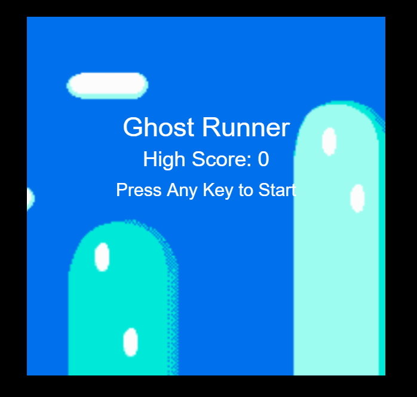
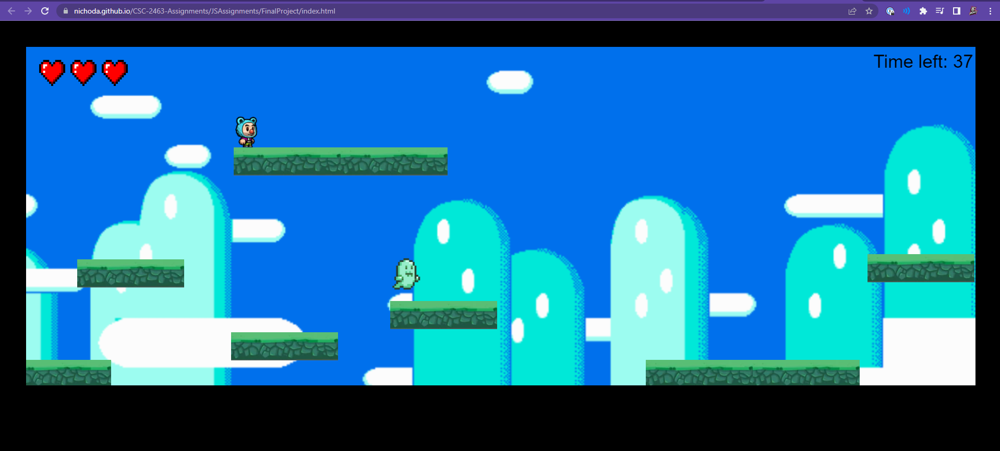
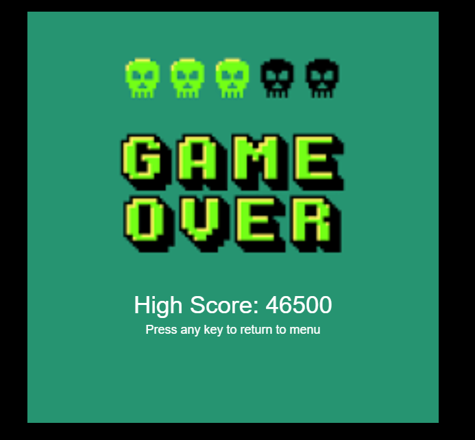
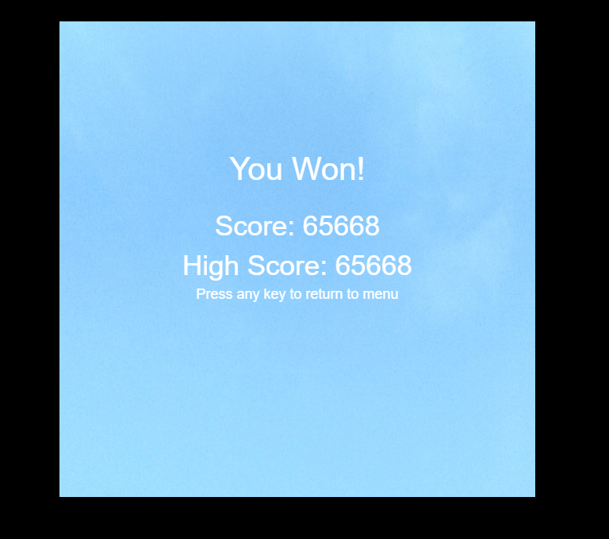

# Final Integration Project Documentation

## Project Outline

Ghost Runner

- Graphics
  - A main character with animation using spritesheet
  - A ghost like enemy that changes direction based off which way it is moving
  - 4 game states with different text and backgrounds
  - The Playing game state will be a 2d side scrolling game, with platforms and a parallax scrolling background
- Audio
  - Each game state has custom made background music using Tone.js
    - Uses unique parameters to make it sound 8-bit like 
  - Each character action has a sound effect (From free website all under 3 seconds)
    - Running, jumping, and getting hit
- Physcial  
  - A joystick that allows the character to move back and forth as well as jump if pressed.
  - A led light that lights up if the player starts to run low on time
- Gameplay 
  - Player attempts to run through 2d course with obstacles such as death pits, ghost enemies, limited lives, and a timer.
  
---

## Description of the Project

This is a 2D platformer game similar to Mario. The goal is to reach the end of each level by jumping and using platforms while avoiding deadly pits and ghosts. Players can move using either the W, A, and D keys, a joystick and button, or a combination of both. Falling into a death trap results in immediate failure, but players have three chances when facing ghosts. There is also a time limit, and when it drops below 20 seconds, an Arduino LED activates to warn the player of low time. Your score is calculated based on how far you progress through the level, with bonus points awarded for completing the entire level. The more hearts and time remaining at the end of the level, the more bonus points you receive.

---

## Images of the Project

### Title State

### Gameplay State

### Game Over State

### You Win State

---

## Video Example of it Working

### Screen Gameplay:

### Gameplay showing working joystick:
https://example.com/video_example.png](https://www.youtube.com/watch?v=00Ni4RLKXig&ab_channel=NicholasDomingue

---

## Images That Help the Reader Understand the Work

---

## Thoughts About Future Development

---
